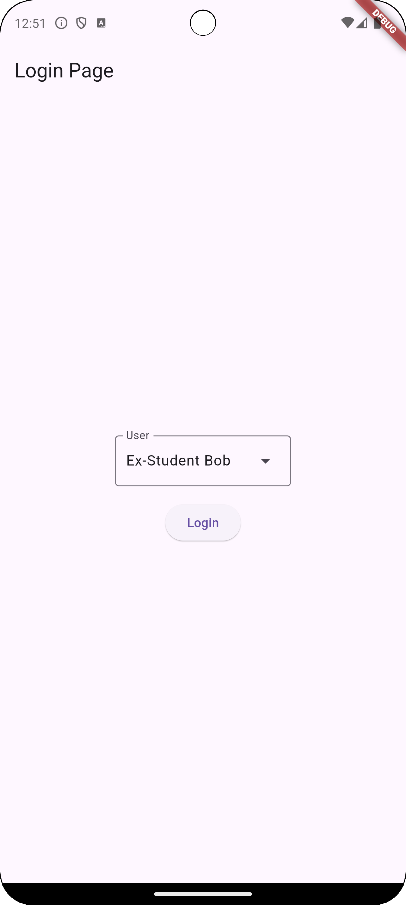
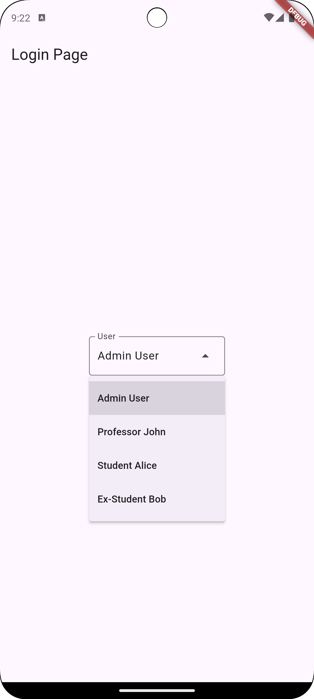
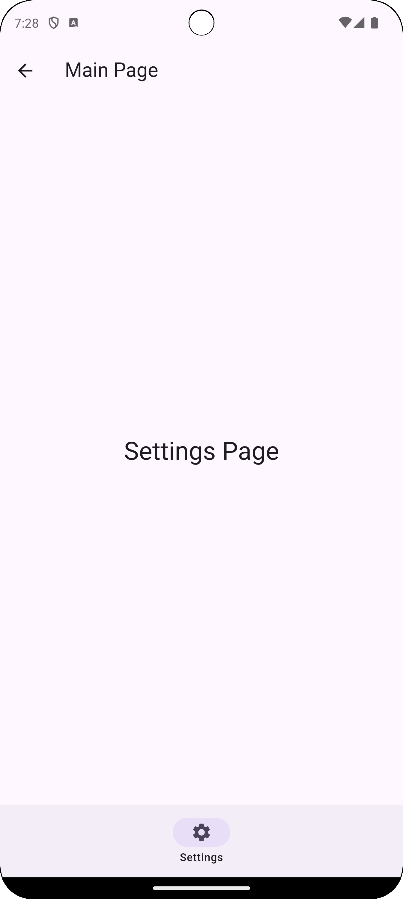

# Navigation Bar と権限管理

釜島 光太郎・株式会社ゆめみ

2025 年 1 月 24 日（金）
YOUTRUST x ビビッドガーデン x ゆめみ Flutter LT会@渋谷

---

# 自己紹介

- 釜島 光太郎（Kotaro Kamashima）
- 株式会社ゆめみ（2023年4月中途入社）
- モバイルアプリケーションエンジニア
- X：[@Kotaro666-dev](https://x.com/Kotaro666_dev)
- 属性
  - 42 Tokyo
  - ヘヴィメタル音楽
  - ウェイトトレーニング

---

# 前提

- 開発環境：Flutter 3.27.2
- どんなアプリケーションを開発している？
  - ログイン後の画面でアカウントに紐づく権限に応じて制御するアプリケーション
- Material Design 3 の Navigation Bar ウィジェットを使った開発でのお話

---

# Debug Build Log

======== Exception caught by widgets library =======================================================
The following assertion was thrown building MainPageWithHiddenBottomBar(dirty, useState<int>: 0):
'package:flutter/src/material/navigation_bar.dart': Failed assertion: line 114 pos 16: 'destinations.length >= 2': is not true.

---

# アカウントと権限

| アカウント | 権限で許可された画面 |
| --- | --- |
| Admin User | Dashboard, Students, Chat, Settings |
| Professor John | Dashboard, Students, Settings |
| Student Alice | Chat, Settings |
| Ex-Student Bob | Settings |

--- 

# Navigation Bar の仕様

> Navigation bars should be used for:
> - Three to five destinations

> Don’t use a navigation bar for fewer than three destinations. Instead, use tabs.

- Material Design 3
  - ナビゲーションバーの数 ≧ 3
- Flutter ライブラリ
  - ナビゲーションバーの数 ≧ 2 

出典：https://m3.material.io/components/navigation-bar/guidelines

---

# 権限による制御案

1. 権限に応じてナビゲーションバーを **非表示** して制御する
2. 権限に応じてナビゲーションバーを **非活性化** して制御する
3. 権限に応じてナビゲーションバーの **画面内** で制御する

---

# 非表示による制御

## Pros

- シンプルな UI
- セキュリティの向上

## Cons

- Material Design ガイドラインの逸脱

---

# 非活性化による制御

## Pros

- Material Design ガイドラインの遵守
- ユーザーに対する権限制御のヒントを提供

## Cons

- ユーザーに対する混乱を招く恐れ
- 通知件数などのバッジ制御

---

# 各画面内での制御

## Pros

- Material Design ガイドラインの遵守
- 画面ごとの細かな権限対応が可能

## Cons

- 実装の複雑化
- ユーザーフレンドリーではない

---

# 発表者が採用した案

- 非表示による制御

## 理由

- デバッグビルドのみで発生する問題である
- Ex-Student Bob アカウントのようにナビゲーションバー1つだけしかアクセスできないケースがあまりない
- 権限がなかったら参照できない要件のみを実現する必要がある
- 画面ごとに細かな権限対応する必要がない

---

# Thank you!!

## サンプルプロジェクト

[Kotaro666-dev/yumemi_grow_lightning_talk_20250124](https://github.com/Kotaro666-dev/yumemi_grow_lightning_talk_20250124)
